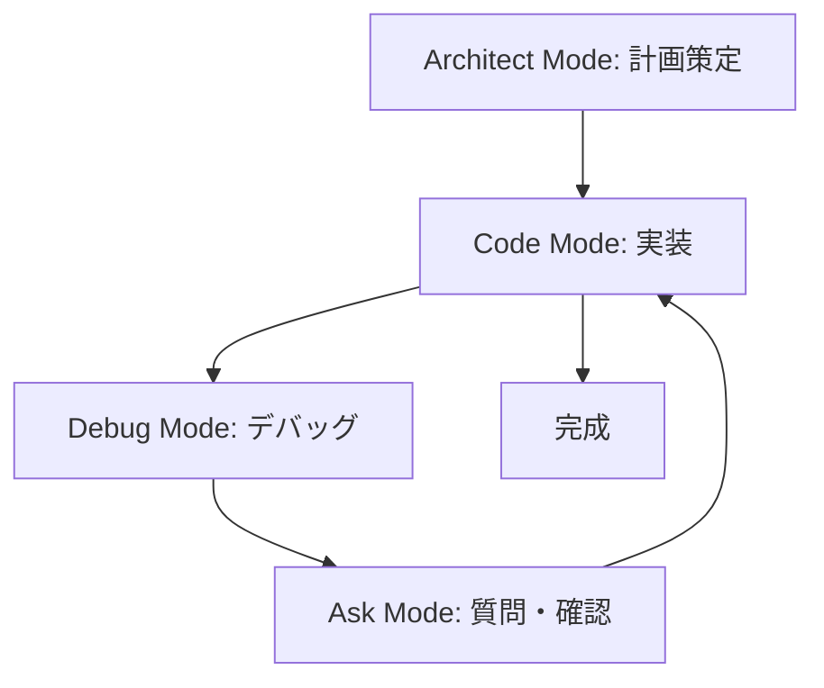

# Local Sync Board - 実装計画

## 📁 計画ドキュメント一覧

このディレクトリには、Local Sync Board プロジェクトの実装計画に関するドキュメントが含まれています。

### 1. [expo-setup-plan.md](expo-setup-plan.md)

**Expo プロジェクトセットアップの詳細計画**

- プロジェクト構造の設計
- セットアップ手順の詳細
- Supabase 統合方法
- 環境変数の設定
- TypeScript 型定義の整備

**対象者**: 開発環境をセットアップする開発者

### 2. [dependencies.md](dependencies.md)

**依存関係の完全リスト**

- 必須パッケージの説明
- オプションパッケージの説明
- インストールコマンド
- バージョン管理の注意事項

**対象者**: パッケージ管理を行う開発者

### 3. [implementation-roadmap.md](implementation-roadmap.md)

**実装ロードマップとフェーズ計画**

- Phase 0-8 の詳細な実装計画
- 各フェーズのタスクと成果物
- MVP スコープの定義
- 技術的考慮事項

**対象者**: プロジェクト全体を把握したい開発者・PM

---

## 🎯 現在の状態

### Phase 0: 環境セットアップ (進行中)

**完了したタスク**:

- ✅ プロジェクト設計ドキュメントの作成 ([`docs/`](../docs/) ディレクトリ)
- ✅ 実装計画の策定 (このディレクトリ)

**次のタスク**:

1. Expo プロジェクトの作成
2. 依存関係のインストール
3. 基本構造の構築
4. Supabase クライアントの設定

---

## 🚀 クイックスタート

### ステップ 1: 計画の確認

1. [`expo-setup-plan.md`](expo-setup-plan.md) を読んで全体像を把握
2. [`dependencies.md`](dependencies.md) で必要なパッケージを確認
3. [`implementation-roadmap.md`](implementation-roadmap.md) で実装の流れを理解

### ステップ 2: Code モードへ切り替え

Architect モードでの計画が完了したら、**Code モード**に切り替えて実装を開始します。

```
💻 Code モードで実行するコマンド:
1. npx create-expo-app@latest app --template blank-typescript
2. cd app && npm install @supabase/supabase-js @react-native-async-storage/async-storage react-native-url-polyfill
3. 必要なファイルとディレクトリの作成
```

### ステップ 3: 実装開始

Phase 1 (認証機能) から順番に実装を進めます。

---

## 📊 プロジェクト構造 (予定)

```
local-sync-board/
├── docs/                           # 設計ドキュメント (既存)
│   ├── 01_Requirements.md
│   ├── 02_Basic_Design.md
│   ├── 03_Data_Model.md
│   └── 04_Tech_Architecture.md
│
├── plans/                          # 実装計画 (現在のディレクトリ)
│   ├── README.md                   # このファイル
│   ├── expo-setup-plan.md
│   ├── dependencies.md
│   └── implementation-roadmap.md
│
└── app/                            # Expo プロジェクト (これから作成)
    ├── App.tsx
    ├── package.json
    ├── tsconfig.json
    ├── .env.example
    │
    ├── lib/                        # ライブラリ・設定
    │   └── supabase.ts
    │
    ├── types/                      # TypeScript 型定義
    │   └── index.ts
    │
    ├── screens/                    # 画面コンポーネント
    │   ├── WelcomeScreen.tsx
    │   ├── HomeScreen.tsx
    │   ├── CreateRoomScreen.tsx
    │   ├── JoinRoomScreen.tsx
    │   └── GameScreen.tsx
    │
    ├── components/                 # 再利用可能なコンポーネント
    │   ├── common/
    │   ├── room/
    │   └── game/
    │
    ├── hooks/                      # カスタムフック
    │   ├── useAuth.ts
    │   ├── useRealtimeRoom.ts
    │   └── useRoomState.ts
    │
    ├── contexts/                   # Context API
    │   └── AuthContext.tsx
    │
    └── utils/                      # ユーティリティ関数
        └── calculations.ts
```

---

## 🔄 開発ワークフロー



### モード別の役割

- **🏗️ Architect Mode** (現在): 計画・設計・ドキュメント作成
- **💻 Code Mode**: 実装・コーディング
- **🪲 Debug Mode**: バグ修正・トラブルシューティング
- **❓ Ask Mode**: 技術的な質問・説明

---

## 📋 実装チェックリスト

### Phase 0: 環境セットアップ

- [ ] Expo プロジェクト作成
- [ ] 依存関係インストール
- [ ] プロジェクト構造構築
- [ ] Supabase クライアント設定
- [ ] 型定義ファイル作成

### Phase 1: 認証

- [ ] 匿名ログイン実装
- [ ] ニックネーム設定画面
- [ ] プロファイル管理
- [ ] 認証状態管理

### Phase 2: ルーム管理

- [ ] ルーム作成機能
- [ ] ルーム参加機能
- [ ] ルームコード生成
- [ ] ルーム一覧表示

### Phase 3: ゲーム画面

- [ ] ゲーム画面レイアウト
- [ ] プレイヤー一覧表示
- [ ] スコア操作機能
- [ ] Realtime 同期実装

### Phase 4-8: 拡張機能

- [ ] テンプレート機能
- [ ] QR コード機能
- [ ] UI/UX 改善
- [ ] テスト実装
- [ ] デプロイ準備

---

## 🎯 MVP (最小限の機能) スコープ

最初のリリースでは以下の機能を実装:

1. ✅ **認証**: 匿名ログイン + ニックネーム設定
2. ✅ **ルーム管理**: 作成・参加 (コード入力)
3. ✅ **ゲーム画面**: スコア表示・操作
4. ✅ **リアルタイム同期**: Supabase Realtime
5. ⚠️ **テンプレート**: プリセットのみ (麻雀)

**後回しにする機能**:

- QR コード機能
- カスタムテンプレート作成
- 高度な UI/UX
- 詳細なテスト

---

## 🛠️ 技術スタック (再確認)

| カテゴリ       | 技術                | 理由                       |
| -------------- | ------------------- | -------------------------- |
| **Frontend**   | React Native (Expo) | クロスプラットフォーム開発 |
| **Language**   | TypeScript          | 型安全性                   |
| **Backend**    | Supabase            | BaaS、Realtime 機能        |
| **Database**   | PostgreSQL          | Supabase に含まれる        |
| **Auth**       | Supabase Auth       | 匿名認証サポート           |
| **Storage**    | AsyncStorage        | セッション永続化           |
| **Navigation** | React Navigation    | 標準的なナビゲーション     |

---

## 📚 参考リンク

### 公式ドキュメント

- [Expo Documentation](https://docs.expo.dev/)
- [React Native Documentation](https://reactnavigation.org/)
- [Supabase Documentation](https://supabase.com/docs)
- [TypeScript Documentation](https://www.typescriptlang.org/docs/)

### チュートリアル

- [Supabase + React Native Tutorial](https://supabase.com/docs/guides/getting-started/tutorials/with-expo-react-native)
- [React Navigation Getting Started](https://reactnavigation.org/docs/getting-started)

### コミュニティ

- [Expo Forums](https://forums.expo.dev/)
- [Supabase Discord](https://discord.supabase.com/)

---

## ⚠️ 重要な注意事項

1. **環境変数の管理**

   - `.env` ファイルは Git にコミットしない
   - Supabase の API キーは公開しない

2. **Supabase セットアップ**

   - プロジェクトコードとは別に Supabase プロジェクトの作成が必要
   - データベーススキーマの作成が必要
   - RLS ポリシーの設定が必要

3. **開発環境**

   - Node.js 18+ 推奨
   - iOS 開発には macOS が必要
   - Android 開発には Android Studio が必要

4. **テスト環境**
   - Expo Go アプリで基本的な開発が可能
   - ネイティブモジュールを使う場合は開発ビルドが必要

---

## 🎉 次のアクション

### Architect モードでの作業 (完了)

- ✅ プロジェクト計画の策定
- ✅ ドキュメントの作成
- ✅ 技術選定の確認

### Code モードへの移行 (次のステップ)

**準備完了！** Code モードに切り替えて、以下のコマンドから実装を開始できます：

```bash
# 1. Expo プロジェクトの作成
npx create-expo-app@latest app --template blank-typescript

# 2. 依存関係のインストール
cd app
npm install @supabase/supabase-js @react-native-async-storage/async-storage react-native-url-polyfill

# 3. 開発サーバーの起動
npx expo start
```

---

## 📞 サポート

質問や不明点がある場合は、**Ask モード**に切り替えて質問してください。

---

**最終更新**: 2026-01-03
**ステータス**: Phase 0 (環境セットアップ) - 計画完了、実装準備完了
