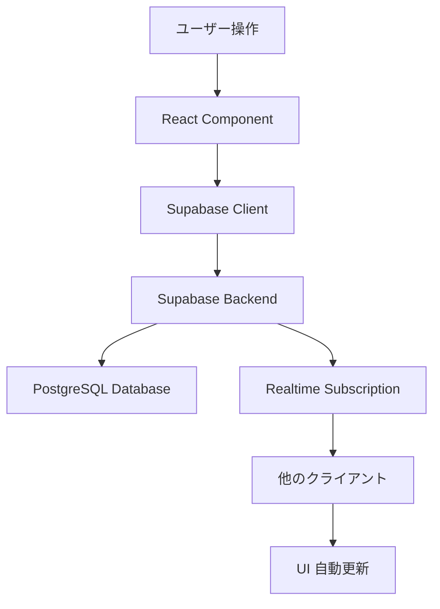

# React Native (Expo) + TypeScript + Supabase プロジェクトセットアップ計画

## 📋 プロジェクト概要

Local Sync Board (Cloud Edition) - アナログゲームの点数・変数管理をリアルタイム同期するモバイルアプリ

## 🎯 セットアップ目標

1. Expo (React Native) プロジェクトの初期化
2. Supabase クライアントの統合
3. TypeScript 型定義の整備
4. プロジェクト構造の構築

## 📦 技術スタック

- **Frontend Framework**: React Native (Expo SDK)
- **Language**: TypeScript
- **Backend/Database**: Supabase (PostgreSQL + Realtime)
- **Authentication**: Supabase Auth (Anonymous Login)
- **State Management**: React Context API / React Query (検討中)

## 🗂️ プロジェクト構造

```
local-sync-board/
├── docs/                    # 既存の設計ドキュメント
├── plans/                   # 実装計画ドキュメント
└── app/                     # Expo プロジェクト (新規作成)
    ├── App.tsx              # エントリーポイント
    ├── app.json             # Expo 設定
    ├── package.json         # 依存関係
    ├── tsconfig.json        # TypeScript 設定
    ├── .env.example         # 環境変数テンプレート
    ├── lib/                 # ユーティリティ・設定
    │   └── supabase.ts      # Supabase クライアント初期化
    ├── types/               # TypeScript 型定義
    │   └── index.ts         # 共通型定義
    ├── screens/             # 画面コンポーネント
    │   ├── HomeScreen.tsx
    │   ├── CreateRoomScreen.tsx
    │   └── GameScreen.tsx
    ├── components/          # 再利用可能なコンポーネント
    │   ├── common/          # 汎用コンポーネント
    │   └── game/            # ゲーム固有コンポーネント
    ├── hooks/               # カスタムフック
    │   └── useSupabase.ts
    └── utils/               # ヘルパー関数
        └── calculations.ts
```

## 🔧 セットアップ手順

### 1. Expo プロジェクト作成

```bash
npx create-expo-app@latest app --template blank-typescript
```

このコマンドで以下が生成されます：

- TypeScript 設定済みの Expo プロジェクト
- 基本的な App.tsx
- package.json と依存関係

### 2. 必要な依存関係のインストール

#### Supabase 関連

```bash
cd app
npm install @supabase/supabase-js
npm install @react-native-async-storage/async-storage
npm install react-native-url-polyfill
```

**理由:**

- `@supabase/supabase-js`: Supabase クライアント SDK
- `@react-native-async-storage/async-storage`: セッション永続化用
- `react-native-url-polyfill`: React Native 環境での URL API サポート

#### ナビゲーション (オプション - 後で追加可能)

```bash
npm install @react-navigation/native @react-navigation/native-stack
npm install react-native-screens react-native-safe-area-context
```

#### UI ライブラリ (オプション)

```bash
npm install react-native-paper
```

#### 開発ツール

```bash
npm install --save-dev @types/react @types/react-native
```

### 3. Supabase クライアント設定

[`lib/supabase.ts`](app/lib/supabase.ts) を作成:

```typescript
import "react-native-url-polyfill/auto";
import AsyncStorage from "@react-native-async-storage/async-storage";
import { createClient } from "@supabase/supabase-js";

const supabaseUrl = process.env.EXPO_PUBLIC_SUPABASE_URL || "";
const supabaseAnonKey = process.env.EXPO_PUBLIC_SUPABASE_ANON_KEY || "";

export const supabase = createClient(supabaseUrl, supabaseAnonKey, {
  auth: {
    storage: AsyncStorage,
    autoRefreshToken: true,
    persistSession: true,
    detectSessionInUrl: false,
  },
});
```

### 4. 環境変数設定

[`.env.example`](app/.env.example) を作成:

```env
EXPO_PUBLIC_SUPABASE_URL=https://your-project.supabase.co
EXPO_PUBLIC_SUPABASE_ANON_KEY=your-anon-key
```

**注意:** 実際の `.env` ファイルは `.gitignore` に追加する

### 5. TypeScript 型定義

[`types/index.ts`](app/types/index.ts) を作成:

```typescript
// データモデル型定義 (docs/03_Data_Model.md に基づく)

export interface Room {
  id: string;
  room_code: string;
  host_user_id: string;
  status: "waiting" | "playing" | "finished";
  template: GameTemplate;
  current_state: GameState;
  created_at: string;
}

export interface Profile {
  id: string;
  display_name: string;
  current_room_id?: string;
}

export interface GameTemplate {
  variables: Variable[];
  actions: Action[];
}

export interface Variable {
  key: string;
  label: string;
  initial: number;
}

export interface Action {
  label: string;
  calc: string;
}

export interface GameState {
  [userId: string]: PlayerState;
}

export interface PlayerState {
  [key: string]: number | string;
  _status?: string;
}
```

### 6. プロジェクト構造の作成

必要なディレクトリを作成:

```bash
cd app
mkdir -p lib types screens components/common components/game hooks utils
```

### 7. TypeScript 設定の確認

[`tsconfig.json`](app/tsconfig.json) を確認し、必要に応じて調整:

```json
{
  "extends": "expo/tsconfig.base",
  "compilerOptions": {
    "strict": true,
    "baseUrl": ".",
    "paths": {
      "@/*": ["./*"]
    }
  }
}
```

## 🔐 Supabase セットアップ (別途必要)

プロジェクトコードとは別に、Supabase 側で以下の設定が必要です：

1. **Supabase プロジェクト作成**

   - https://supabase.com でプロジェクトを作成
   - URL と Anon Key を取得

2. **データベーススキーマ作成**

   - `docs/03_Data_Model.md` に基づいてテーブルを作成
   - `rooms` テーブル
   - `profiles` テーブル

3. **RLS (Row Level Security) 設定**

   - 適切なセキュリティポリシーを設定

4. **Realtime 有効化**
   - `rooms` テーブルで Realtime を有効化

## 📱 開発開始

セットアップ完了後、以下のコマンドで開発サーバーを起動:

```bash
cd app
npx expo start
```

オプション:

- `npx expo start --ios` - iOS シミュレータで起動
- `npx expo start --android` - Android エミュレータで起動
- `npx expo start --web` - Web ブラウザで起動

## 🎨 次のステップ (実装フェーズ)

1. **認証フロー実装**

   - 匿名ログイン機能
   - ニックネーム設定画面

2. **ルーム管理機能**

   - ルーム作成画面
   - ルーム参加画面 (QR コード / ルームコード入力)

3. **ゲーム画面実装**

   - プレイヤー一覧表示
   - スコア操作 UI
   - リアルタイム同期

4. **テンプレート機能**
   - ゲームテンプレート作成
   - テンプレート保存・読み込み

## 🔄 アーキテクチャフロー



## 📝 重要な注意事項

1. **環境変数の管理**

   - `.env` ファイルは Git にコミットしない
   - `.env.example` をテンプレートとして提供

2. **TypeScript の厳格性**

   - `strict: true` を維持
   - 型安全性を最優先

3. **Supabase Realtime**

   - 接続状態の監視が重要
   - オフライン時のエラーハンドリング

4. **パフォーマンス**
   - 不要な再レンダリングを避ける
   - Realtime サブスクリプションの適切なクリーンアップ

## ✅ セットアップ完了チェックリスト

- [ ] Expo プロジェクトが正常に作成された
- [ ] 依存関係がすべてインストールされた
- [ ] Supabase クライアントが設定された
- [ ] 環境変数ファイルが作成された
- [ ] TypeScript 型定義が整備された
- [ ] プロジェクト構造が構築された
- [ ] `npx expo start` でアプリが起動する
- [ ] Supabase プロジェクトが作成された (別途)
- [ ] データベーススキーマが作成された (別途)

## 🚀 実装準備完了

このセットアップが完了すれば、Code モードに切り替えて実際の機能実装を開始できます。
