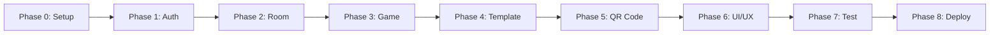

# 実装ロードマップ

## 🎯 プロジェクト目標

Local Sync Board - リアルタイム同期機能を持つアナログゲーム用スコア管理アプリの実装

## 📊 実装フェーズ

### Phase 0: 環境セットアップ ✅ (完了)

**目標**: 開発環境の構築とプロジェクトの初期化

**タスク**:

- [x] プロジェクト設計ドキュメントの作成
- [x] Expo プロジェクトの作成
- [x] 依存関係のインストール (expo-router, react-native-safe-area-context, etc.)
- [x] 基本的なプロジェクト構造の構築 (app/ ディレクトリ、ファイルベースルーティング)
- [x] Supabase クライアントの設定
- [x] ホーム画面 (S-01) の実装

**成果物**:

- ✅ 動作する Expo アプリケーション
- ✅ Supabase 接続の確認
- ✅ expo-router によるファイルベースルーティング
- ✅ ホーム画面（部屋を作る/部屋に入るボタン）

---

### Phase 1: 認証とユーザー管理

**目標**: 匿名認証とユーザープロファイル管理の実装

**タスク**:

1. 匿名ログイン機能の実装
2. ニックネーム設定画面の作成
3. ユーザープロファイルの Supabase への保存
4. 認証状態の管理 (Context API)

**画面**:

- [`WelcomeScreen.tsx`](app/screens/WelcomeScreen.tsx) - 初回起動時のニックネーム入力
- [`ProfileScreen.tsx`](app/screens/ProfileScreen.tsx) - プロファイル編集

**主要コンポーネント**:

- [`AuthContext.tsx`](app/contexts/AuthContext.tsx) - 認証状態管理
- [`useAuth.ts`](app/hooks/useAuth.ts) - 認証カスタムフック

**Supabase 設定**:

- Anonymous Auth の有効化
- `profiles` テーブルの作成
- RLS ポリシーの設定

**検証方法**:

- アプリ起動時に匿名ログインが成功する
- ニックネームが Supabase に保存される
- アプリ再起動後もセッションが維持される

---

### Phase 2: ルーム管理機能

**目標**: ゲームルームの作成・参加機能の実装

**タスク**:

1. ホーム画面の作成 (ルーム作成/参加の選択)
2. ルーム作成機能の実装
3. ルームコード生成ロジック
4. ルーム参加機能 (コード入力)
5. ルーム一覧表示

**画面**:

- [`HomeScreen.tsx`](app/screens/HomeScreen.tsx) - メイン画面
- [`CreateRoomScreen.tsx`](app/screens/CreateRoomScreen.tsx) - ルーム作成
- [`JoinRoomScreen.tsx`](app/screens/JoinRoomScreen.tsx) - ルーム参加

**主要コンポーネント**:

- [`RoomCodeInput.tsx`](app/components/room/RoomCodeInput.tsx) - ルームコード入力
- [`RoomCard.tsx`](app/components/room/RoomCard.tsx) - ルーム情報表示

**Supabase 設定**:

- `rooms` テーブルの作成
- RLS ポリシーの設定 (room_code による参照許可)
- Realtime の有効化

**検証方法**:

- ルームが正常に作成される
- 4 桁のルームコードが生成される
- 他のユーザーがコードでルームに参加できる

---

### Phase 3: ゲーム画面とリアルタイム同期

**目標**: メインのゲーム画面とリアルタイム同期機能の実装

**タスク**:

1. ゲーム画面のレイアウト作成
2. プレイヤー一覧の表示
3. スコア表示コンポーネント
4. スコア操作ボタン
5. Realtime サブスクリプションの実装
6. 楽観的 UI 更新

**画面**:

- [`GameScreen.tsx`](app/screens/GameScreen.tsx) - メインゲーム画面
- [`GameLobbyScreen.tsx`](app/screens/GameLobbyScreen.tsx) - ゲーム開始前の待機画面

**主要コンポーネント**:

- [`PlayerList.tsx`](app/components/game/PlayerList.tsx) - プレイヤー一覧
- [`PlayerCard.tsx`](app/components/game/PlayerCard.tsx) - 個別プレイヤー情報
- [`ScoreDisplay.tsx`](app/components/game/ScoreDisplay.tsx) - スコア表示
- [`ActionButtons.tsx`](app/components/game/ActionButtons.tsx) - 操作ボタン

**カスタムフック**:

- [`useRealtimeRoom.ts`](app/hooks/useRealtimeRoom.ts) - Realtime サブスクリプション管理
- [`useRoomState.ts`](app/hooks/useRoomState.ts) - ルーム状態管理

**検証方法**:

- 複数デバイスでスコアがリアルタイムに同期される
- 接続が切れた場合の適切なエラー表示
- 再接続時の状態復元

---

### Phase 4: テンプレート機能

**目標**: ゲームテンプレートの作成・管理機能

**タスク**:

1. テンプレート作成画面
2. 変数定義 UI (名前、初期値)
3. アクション定義 UI (ボタン名、計算式)
4. テンプレート保存機能
5. テンプレート選択機能
6. プリセットテンプレート (麻雀など)

**画面**:

- [`TemplateEditorScreen.tsx`](app/screens/TemplateEditorScreen.tsx) - テンプレート編集
- [`TemplateListScreen.tsx`](app/screens/TemplateListScreen.tsx) - テンプレート一覧

**主要コンポーネント**:

- [`VariableEditor.tsx`](app/components/template/VariableEditor.tsx) - 変数編集
- [`ActionEditor.tsx`](app/components/template/ActionEditor.tsx) - アクション編集
- [`TemplatePreview.tsx`](app/components/template/TemplatePreview.tsx) - プレビュー

**ユーティリティ**:

- [`calculateExpression.ts`](app/utils/calculateExpression.ts) - 計算式評価

**検証方法**:

- カスタムテンプレートが作成できる
- 計算式が正しく評価される
- テンプレートがルーム作成時に適用される

---

### Phase 5: QR コード機能

**目標**: QR コードによるルーム参加機能

**タスク**:

1. QR コード生成機能
2. QR コードスキャン機能
3. カメラ権限の処理
4. QR コード表示画面

**画面**:

- [`QRCodeScreen.tsx`](app/screens/QRCodeScreen.tsx) - QR コード表示
- [`QRScannerScreen.tsx`](app/screens/QRScannerScreen.tsx) - QR コードスキャン

**依存関係追加**:

```bash
npm install expo-camera react-native-qrcode-svg
```

**検証方法**:

- ルームコードが QR コードとして表示される
- QR コードをスキャンしてルームに参加できる

---

### Phase 6: UI/UX 改善

**目標**: ユーザー体験の向上

**タスク**:

1. ローディング状態の改善
2. エラーハンドリングの強化
3. トースト通知の実装
4. アニメーション追加
5. ダークモード対応
6. アクセシビリティ対応

**主要コンポーネント**:

- [`LoadingOverlay.tsx`](app/components/common/LoadingOverlay.tsx)
- [`ErrorBoundary.tsx`](app/components/common/ErrorBoundary.tsx)
- [`Toast.tsx`](app/components/common/Toast.tsx)

---

### Phase 7: テストとデバッグ

**目標**: 品質保証とバグ修正

**タスク**:

1. ユニットテストの作成
2. 統合テストの実装
3. E2E テストの実装
4. パフォーマンス最適化
5. メモリリーク対策

**依存関係追加**:

```bash
npm install --save-dev @testing-library/react-native jest
```

---

### Phase 8: デプロイ準備

**目標**: 本番環境へのデプロイ準備

**タスク**:

1. アプリアイコンの作成
2. スプラッシュスクリーンの設定
3. アプリ名・説明の設定
4. プライバシーポリシーの作成
5. ビルド設定の最適化
6. EAS Build の設定

**コマンド**:

```bash
npx expo install expo-dev-client
eas build --platform ios
eas build --platform android
```

---

## 🔄 開発フロー



## 📋 各フェーズの推奨期間

**注意**: これは参考情報であり、実際の開発速度は開発者のスキルレベルや利用可能な時間によって大きく異なります。

- Phase 0: セットアップ - 準備段階
- Phase 1: 認証 - 基礎機能
- Phase 2: ルーム管理 - コア機能
- Phase 3: ゲーム画面 - 最重要機能
- Phase 4: テンプレート - 拡張機能
- Phase 5: QR コード - 便利機能
- Phase 6: UI/UX - 品質向上
- Phase 7: テスト - 品質保証
- Phase 8: デプロイ - リリース準備

## 🎯 MVP (Minimum Viable Product) スコープ

最小限の機能でリリースする場合、以下のフェーズを優先:

1. **Phase 0**: 環境セットアップ (必須)
2. **Phase 1**: 認証 (必須)
3. **Phase 2**: ルーム管理 (必須)
4. **Phase 3**: ゲーム画面 (必須)
5. **Phase 4**: テンプレート (簡易版 - プリセットのみ)

Phase 5-8 は MVP 後に追加可能

## 🔧 技術的な考慮事項

### パフォーマンス

- Realtime サブスクリプションの適切な管理
- 不要な再レンダリングの防止 (React.memo, useMemo)
- 大量のプレイヤーがいる場合の最適化

### セキュリティ

- RLS ポリシーの適切な設定
- クライアント側での入力検証
- レート制限の実装

### エラーハンドリング

- ネットワークエラーの処理
- Supabase エラーの適切な表示
- オフライン時の動作

### 状態管理

- Context API vs Zustand vs React Query の選択
- グローバル状態とローカル状態の分離

## 📚 参考資料

- [Supabase Realtime Guide](https://supabase.com/docs/guides/realtime)
- [React Native Best Practices](https://reactnative.dev/docs/performance)
- [Expo Development Workflow](https://docs.expo.dev/workflow/overview/)

## ✅ 次のステップ

Phase 0 (環境セットアップ) が完了したら、**Code モード**に切り替えて Phase 1 の実装を開始します。
