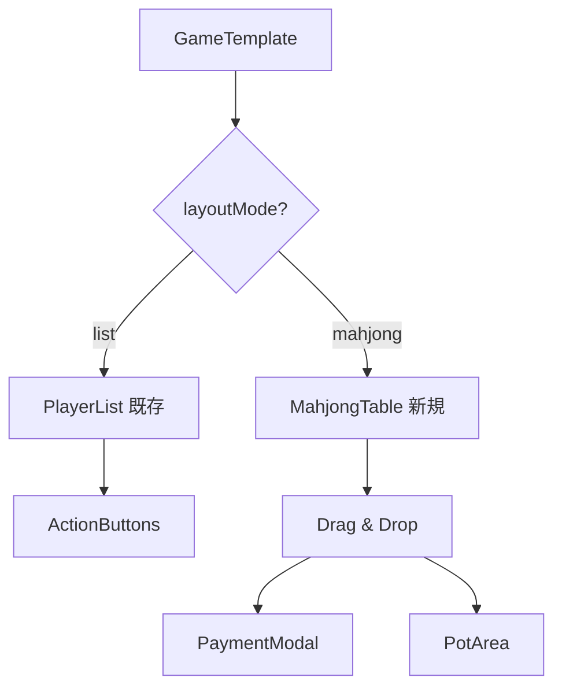
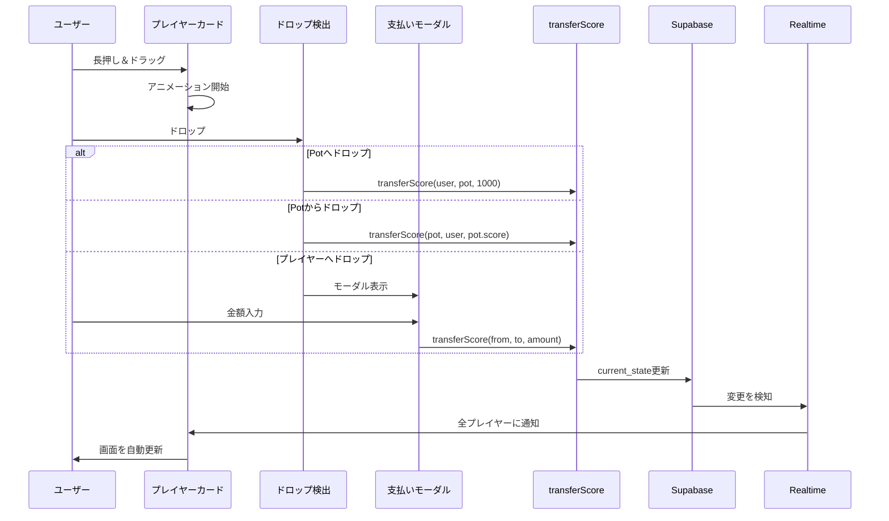

# 🛑 Phase 3: 仕様変更と実装方針の統合 (UI/UX Pivot with Layout Modes)

## ⚠️ 重要な実装上の注意事項

### 🔴 1. 実行順序の変更（最重要）

**Phase 3E（ライブラリ導入）を一番最初に実行してください。**

`react-native-gesture-handler`や`react-native-reanimated`は、ネイティブ側のセットアップが必要なため、最初に環境を整えてから UI 実装に入ります。

**正しい実行順序:**

1. **Phase 3E: ライブラリ導入** ← 最初
2. Phase 3A: データモデル拡張
3. Phase 3B: 麻雀モード UI 実装
4. Phase 3C: トランザクション更新
5. Phase 3D: ゲーム画面統合

**重要:** `app/_layout.tsx`への`GestureHandlerRootView`の配置も忘れずに行ってください。

### 🔴 2. Pot データの保存構造

Supabase の`current_state` JSON カラムの構造について、ユーザー ID との衝突を避けるため、**予約キー`"__pot__"`**を使用します。

```typescript
// current_state の構造
type RoomState = {
  // 予約キー: 供託金 (Pot)
  __pot__: {
    score: number; // 現在の供託金合計
    riichi?: number; // リーチ棒の本数（オプション）
  };
  // それ以外のキー: 各プレイヤーのUUID
  [userId: string]: PlayerState;
};
```

**API 実装時の注意:**

- `userId`が`"__pot__"`の場合と、通常の UUID の場合で処理を分ける
- `Object.keys(gameState).filter(id => id !== '__pot__')`でプレイヤーのみを取得

### 🔴 3. 座席ロジックの要件

座席配置は**「自分（ログインユーザー）が常に画面下（Bottom）」**に来るように配列をローテートさせて表示します。

```
配置イメージ:
    上 (Top): 対面

左 (Left): 上家    右 (Right): 下家

    下 (Bottom): 自分 (Me)
```

**実装のポイント:**

- 自分を基準に他のプレイヤーを相対的に配置
- プレイヤーの順序を保持（時計回り）
- 3 人麻雀の場合は左席を空席にする

### 🔴 4. トランザクション処理の注意点

通信ラグによる不整合を防ぐため、**案 B: クライアント側で最新データを取得してから更新**を採用します。

```typescript
// 正しいトランザクション処理
export async function transferScore(...) {
  try {
    // 1. 最新の current_state を取得（重要！）
    const { data: room } = await supabase
      .from('rooms')
      .select('current_state')
      .eq('id', roomId)
      .single();

    // 2. 最新データを元に計算
    const currentState = { ...room.current_state };
    // ... 計算処理 ...

    // 3. 更新
    await supabase
      .from('rooms')
      .update({ current_state: currentState })
      .eq('id', roomId);
  }
}
```

**将来の改善案（Phase 4 以降）:**

- 案 A: RPC（Postgres Function）を使って DB 側でアトミックに計算
- 楽観的ロックの実装
- バージョン管理の追加

---

## 🎯 目標

これまでの「リスト表示」の実装を活かしつつ、新たに「麻雀卓ライクな UI」を追加し、**テンプレートの設定によって切り替えられる**ように実装する。

**コンセプト:**

- 汎用的なスコア管理（リストモード）
- リッチな麻雀体験（麻雀モード）
- テンプレート設定による自動切り替え

---

## 📊 実装アーキテクチャ



---

## 📋 実装タスク一覧（⚠️ 正しい実行順序）

### ⭐ Phase 3E: ライブラリ導入（最優先・最初に実行）

- [ ] タスク 5-1: react-native-gesture-handler のインストール
- [ ] タスク 5-2: react-native-reanimated のインストール
- [ ] タスク 5-3: app/\_layout.tsx への GestureHandlerRootView 配置
- [ ] タスク 5-4: babel.config.js の更新
- [ ] タスク 5-5: アプリの再起動と動作確認

### Phase 3A: データモデル拡張

- [ ] タスク 1-1: 型定義の更新（layoutMode, PotState 等）
- [ ] タスク 1-2: GameState の構造変更（`__pot__`キーの追加）
- [ ] タスク 1-3: テンプレートの更新（麻雀/汎用）

### Phase 3B: 麻雀モード UI 実装

- [ ] タスク 2-1: 座席配置ロジック（seatUtils.ts）- 自分を下に固定
- [ ] タスク 2-2: 供託金エリアコンポーネント（PotArea.tsx）
- [ ] タスク 2-3: 麻雀テーブルコンポーネント（MahjongTable.tsx）
- [ ] タスク 2-4: ドラッグ可能なプレイヤーカード（MahjongPlayerCard.tsx）
- [ ] タスク 2-5: 支払いモーダル（PaymentModal.tsx）

### Phase 3C: トランザクション更新

- [ ] タスク 3-1: スコア移動 API（transferScore）- 最新データ取得を含む

### Phase 3D: ゲーム画面統合

- [ ] タスク 4-1: レイアウトモード切り替えロジック
- [ ] タスク 4-2: 既存のリストモードとの統合

---

## 1️⃣ データモデルの拡張

### タスク 1-1: 型定義の更新

**ファイル:** [`app/types/index.ts`](../app/types/index.ts)

**追加する型定義:**

```typescript
/**
 * レイアウトモード
 */
export type LayoutMode = "list" | "mahjong";

/**
 * ゲームテンプレート定義（拡張版）
 */
export interface GameTemplate {
  variables: Variable[];
  actions: Action[];
  layoutMode?: LayoutMode; // デフォルトは "list"
  maxPlayers?: number; // 最大プレイヤー数（麻雀モードでは4）
  potEnabled?: boolean; // 供託金機能の有効化
}

/**
 * ゲーム状態（拡張版）
 * 注意: "__pot__"は予約キーとして使用
 */
export interface GameState {
  __pot__?: PotState; // 供託金エリア（予約キー）
  [userId: string]: PlayerState | PotState; // プレイヤーまたはPot
}

/**
 * 供託金状態
 */
export interface PotState {
  score: number; // 供託金の合計
  riichi?: number; // リーチ棒の本数
}

/**
 * プレイヤーの座席位置
 */
export type SeatPosition = "bottom" | "top" | "left" | "right";

/**
 * 座席配置マップ
 */
export interface SeatMap {
  [userId: string]: SeatPosition;
}

/**
 * スコア移動リクエスト
 */
export interface TransferScoreRequest {
  room_id: string;
  from_id: string; // "pot" または userId
  to_id: string; // "pot" または userId
  amount: number;
  variable?: string; // 移動する変数（デフォルトは "score"）
}
```

### タスク 1-2: テンプレートの更新

**ファイル:** [`app/app/(tabs)/create-room.tsx`](<../app/app/(tabs)/create-room.tsx>)

**麻雀テンプレートの更新:**

```typescript
const mahjongTemplate: GameTemplate = {
  layoutMode: "mahjong", // 麻雀モードを指定
  maxPlayers: 4,
  potEnabled: true,
  variables: [
    { key: "score", label: "点数", initial: 25000 },
    { key: "riichi", label: "リーチ棒", initial: 0 },
  ],
  actions: [
    { label: "リーチ", calc: "score - 1000" },
    { label: "ツモ1000", calc: "score + 1000" },
    { label: "ツモ2000", calc: "score + 2000" },
    { label: "ツモ3000", calc: "score + 3000" },
    { label: "放銃1000", calc: "score - 1000" },
  ],
};

// 汎用テンプレート（リストモード）
const genericTemplate: GameTemplate = {
  layoutMode: "list", // リストモード（デフォルト）
  variables: [{ key: "score", label: "スコア", initial: 0 }],
  actions: [
    { label: "+1", calc: "score + 1" },
    { label: "+10", calc: "score + 10" },
    { label: "-1", calc: "score - 1" },
  ],
};
```

---

## 2️⃣ 新規レイアウト: "mahjong" モードの実装

### タスク 2-1: 座席配置ロジック

**ファイル:** [`app/utils/seatUtils.ts`](../app/utils/seatUtils.ts)（新規作成）

```typescript
import { SeatPosition, SeatMap } from "../types";

/**
 * プレイヤーを座席に配置
 * @param playerIds - プレイヤーIDの配列
 * @param currentUserId - 現在のユーザーID
 * @returns 座席配置マップ
 */
export function assignSeats(
  playerIds: string[],
  currentUserId: string
): SeatMap {
  const seatMap: SeatMap = {};

  // 自分を下に配置
  seatMap[currentUserId] = "bottom";

  // 他のプレイヤーを配置
  const otherPlayers = playerIds.filter((id) => id !== currentUserId);
  const positions: SeatPosition[] = ["top", "left", "right"];

  otherPlayers.forEach((playerId, index) => {
    if (index < positions.length) {
      seatMap[playerId] = positions[index];
    }
  });

  return seatMap;
}

/**
 * 座席位置からスタイルを取得
 * @param position - 座席位置
 * @returns スタイルオブジェクト
 */
export function getSeatStyle(position: SeatPosition) {
  const baseStyle = {
    position: "absolute" as const,
    width: 120,
    height: 80,
  };

  switch (position) {
    case "bottom":
      return { ...baseStyle, bottom: 20, left: "50%", marginLeft: -60 };
    case "top":
      return { ...baseStyle, top: 20, left: "50%", marginLeft: -60 };
    case "left":
      return { ...baseStyle, left: 20, top: "50%", marginTop: -40 };
    case "right":
      return { ...baseStyle, right: 20, top: "50%", marginTop: -40 };
  }
}
```

### タスク 2-2: 供託金エリアコンポーネント

**ファイル:** [`app/components/game/PotArea.tsx`](../app/components/game/PotArea.tsx)（新規作成）

```typescript
import React from "react";
import { View, Text, StyleSheet } from "react-native";
import { PotState } from "../../types";

interface PotAreaProps {
  pot: PotState;
}

export default function PotArea({ pot }: PotAreaProps) {
  return (
    <View style={styles.container}>
      <View style={styles.potCard}>
        <Text style={styles.label}>供託金</Text>
        <Text style={styles.score}>{pot.score.toLocaleString()}</Text>
        {pot.riichi !== undefined && pot.riichi > 0 && (
          <Text style={styles.riichi}>🎴 {pot.riichi}本</Text>
        )}
      </View>
    </View>
  );
}

const styles = StyleSheet.create({
  container: {
    position: "absolute",
    top: "50%",
    left: "50%",
    marginTop: -50,
    marginLeft: -60,
    width: 120,
    height: 100,
    justifyContent: "center",
    alignItems: "center",
  },
  potCard: {
    backgroundColor: "#fef3c7",
    borderRadius: 12,
    padding: 16,
    borderWidth: 2,
    borderColor: "#f59e0b",
    alignItems: "center",
    shadowColor: "#000",
    shadowOffset: { width: 0, height: 2 },
    shadowOpacity: 0.2,
    shadowRadius: 4,
    elevation: 4,
  },
  label: {
    fontSize: 12,
    color: "#92400e",
    fontWeight: "600",
    marginBottom: 4,
  },
  score: {
    fontSize: 20,
    fontWeight: "bold",
    color: "#92400e",
  },
  riichi: {
    fontSize: 12,
    color: "#92400e",
    marginTop: 4,
  },
});
```

### タスク 2-3: 麻雀テーブルコンポーネント

**ファイル:** [`app/components/game/MahjongTable.tsx`](../app/components/game/MahjongTable.tsx)（新規作成）

```typescript
import React, { useState } from "react";
import { View, StyleSheet } from "react-native";
import { GestureHandlerRootView } from "react-native-gesture-handler";
import { GameState, Variable, PotState } from "../../types";
import { assignSeats, getSeatStyle } from "../../utils/seatUtils";
import MahjongPlayerCard from "./MahjongPlayerCard";
import PotArea from "./PotArea";
import PaymentModal from "./PaymentModal";

interface MahjongTableProps {
  gameState: GameState;
  variables: Variable[];
  currentUserId: string;
  hostUserId: string;
  onTransfer: (fromId: string, toId: string, amount: number) => Promise<void>;
}

export default function MahjongTable({
  gameState,
  variables,
  currentUserId,
  hostUserId,
  onTransfer,
}: MahjongTableProps) {
  const [paymentModal, setPaymentModal] = useState<{
    visible: boolean;
    fromId: string;
    toId: string;
  } | null>(null);

  const playerIds = Object.keys(gameState).filter((id) => id !== "__pot__");
  const seatMap = assignSeats(playerIds, currentUserId);
  const pot = gameState.__pot__ || { score: 0, riichi: 0 };

  const handleDrop = (fromId: string, toId: string) => {
    if (toId === "__pot__") {
      // 供託（リーチ）: 即座に1000点支払い
      onTransfer(fromId, "__pot__", 1000);
    } else if (fromId === "__pot__") {
      // 供託回収: Pot全額を取得
      onTransfer("__pot__", toId, pot.score);
    } else {
      // 対人支払い: モーダルを表示
      setPaymentModal({ visible: true, fromId, toId });
    }
  };

  const handlePaymentConfirm = async (amount: number) => {
    if (paymentModal) {
      await onTransfer(paymentModal.fromId, paymentModal.toId, amount);
      setPaymentModal(null);
    }
  };

  return (
    <GestureHandlerRootView style={styles.container}>
      <View style={styles.table}>
        {/* プレイヤーカード */}
        {playerIds.map((playerId) => {
          const position = seatMap[playerId];
          if (!position) return null;

          return (
            <View
              key={playerId}
              style={[styles.playerContainer, getSeatStyle(position)]}
            >
              <MahjongPlayerCard
                playerId={playerId}
                playerState={gameState[playerId]}
                variables={variables}
                isCurrentUser={playerId === currentUserId}
                isHost={playerId === hostUserId}
                position={position}
                onDrop={handleDrop}
              />
            </View>
          );
        })}

        {/* 供託金エリア */}
        <PotArea pot={pot} />
      </View>

      {/* 支払いモーダル */}
      {paymentModal && (
        <PaymentModal
          visible={paymentModal.visible}
          onClose={() => setPaymentModal(null)}
          onConfirm={handlePaymentConfirm}
          maxAmount={(gameState[paymentModal.fromId]?.score as number) || 0}
        />
      )}
    </GestureHandlerRootView>
  );
}

const styles = StyleSheet.create({
  container: {
    flex: 1,
  },
  table: {
    flex: 1,
    backgroundColor: "#10b981",
    position: "relative",
    minHeight: 600,
  },
  playerContainer: {
    zIndex: 1,
  },
});
```

### タスク 2-4: ドラッグ可能なプレイヤーカード

**ファイル:** [`app/components/game/MahjongPlayerCard.tsx`](../app/components/game/MahjongPlayerCard.tsx)（新規作成）

```typescript
import React from "react";
import { View, Text, StyleSheet, Dimensions } from "react-native";
import { Gesture, GestureDetector } from "react-native-gesture-handler";
import Animated, {
  useSharedValue,
  useAnimatedStyle,
  withSpring,
  runOnJS,
} from "react-native-reanimated";
import { PlayerState, Variable, SeatPosition } from "../../types";

interface MahjongPlayerCardProps {
  playerId: string;
  playerState: PlayerState;
  variables: Variable[];
  isCurrentUser: boolean;
  isHost: boolean;
  position: SeatPosition;
  onDrop: (fromId: string, toId: string) => void;
}

const { width: SCREEN_WIDTH, height: SCREEN_HEIGHT } = Dimensions.get("window");

export default function MahjongPlayerCard({
  playerId,
  playerState,
  variables,
  isCurrentUser,
  isHost,
  position,
  onDrop,
}: MahjongPlayerCardProps) {
  const translateX = useSharedValue(0);
  const translateY = useSharedValue(0);
  const scale = useSharedValue(1);

  const gesture = Gesture.Pan()
    .enabled(isCurrentUser) // 自分のカードのみドラッグ可能
    .onStart(() => {
      scale.value = withSpring(1.1);
    })
    .onUpdate((event) => {
      translateX.value = event.translationX;
      translateY.value = event.translationY;
    })
    .onEnd((event) => {
      // ドロップ先を判定
      const dropTarget = detectDropTarget(event.absoluteX, event.absoluteY);

      if (dropTarget) {
        runOnJS(onDrop)(playerId, dropTarget);
      }

      // 元の位置に戻す
      translateX.value = withSpring(0);
      translateY.value = withSpring(0);
      scale.value = withSpring(1);
    });

  const animatedStyle = useAnimatedStyle(() => ({
    transform: [
      { translateX: translateX.value },
      { translateY: translateY.value },
      { scale: scale.value },
    ],
  }));

  return (
    <GestureDetector gesture={gesture}>
      <Animated.View style={[styles.card, animatedStyle]}>
        <View style={styles.header}>
          {isHost && <Text style={styles.crown}>👑</Text>}
          <Text style={styles.name} numberOfLines={1}>
            {isCurrentUser ? "あなた" : `Player ${playerId.slice(0, 4)}`}
          </Text>
        </View>
        {variables.map((variable) => {
          const value = playerState[variable.key];
          if (typeof value !== "number") return null;

          return (
            <View key={variable.key} style={styles.stat}>
              <Text style={styles.label}>{variable.label}</Text>
              <Text style={styles.value}>{value.toLocaleString()}</Text>
            </View>
          );
        })}
      </Animated.View>
    </GestureDetector>
  );
}

// ドロップ先を判定する関数
function detectDropTarget(x: number, y: number): string | null {
  // 画面中央付近ならPot
  const centerX = SCREEN_WIDTH / 2;
  const centerY = SCREEN_HEIGHT / 2;

  const distanceFromCenter = Math.sqrt(
    Math.pow(x - centerX, 2) + Math.pow(y - centerY, 2)
  );

  // 中央から100px以内ならPot（予約キー "__pot__" を返す）
  if (distanceFromCenter < 100) {
    return "__pot__";
  }

  // TODO: 他のプレイヤーカードとの衝突判定
  // より高度な実装では、各プレイヤーカードの位置を追跡し、
  // ドロップ位置がどのカードに最も近いかを判定する

  return null;
}

const styles = StyleSheet.create({
  card: {
    backgroundColor: "#ffffff",
    borderRadius: 12,
    padding: 12,
    borderWidth: 2,
    borderColor: "#e5e7eb",
    shadowColor: "#000",
    shadowOffset: { width: 0, height: 2 },
    shadowOpacity: 0.1,
    shadowRadius: 4,
    elevation: 3,
    width: 120,
  },
  header: {
    flexDirection: "row",
    alignItems: "center",
    marginBottom: 8,
  },
  crown: {
    fontSize: 16,
    marginRight: 4,
  },
  name: {
    fontSize: 14,
    fontWeight: "600",
    color: "#1f2937",
    flex: 1,
  },
  stat: {
    flexDirection: "row",
    justifyContent: "space-between",
    marginTop: 4,
  },
  label: {
    fontSize: 12,
    color: "#6b7280",
  },
  value: {
    fontSize: 14,
    fontWeight: "bold",
    color: "#1f2937",
  },
});
```

### タスク 2-5: 支払いモーダル

**ファイル:** [`app/components/game/PaymentModal.tsx`](../app/components/game/PaymentModal.tsx)（新規作成）

```typescript
import React, { useState } from "react";
import {
  Modal,
  View,
  Text,
  TextInput,
  TouchableOpacity,
  StyleSheet,
} from "react-native";

interface PaymentModalProps {
  visible: boolean;
  onClose: () => void;
  onConfirm: (amount: number) => void;
  maxAmount: number;
}

export default function PaymentModal({
  visible,
  onClose,
  onConfirm,
  maxAmount,
}: PaymentModalProps) {
  const [amount, setAmount] = useState("");

  const handleConfirm = () => {
    const numAmount = parseInt(amount, 10);
    if (isNaN(numAmount) || numAmount <= 0) {
      return;
    }
    if (numAmount > maxAmount) {
      return;
    }
    onConfirm(numAmount);
    setAmount("");
  };

  const quickAmounts = [1000, 2000, 3000, 5000, 8000, 12000];

  return (
    <Modal
      visible={visible}
      transparent
      animationType="fade"
      onRequestClose={onClose}
    >
      <View style={styles.overlay}>
        <View style={styles.modal}>
          <Text style={styles.title}>支払い金額を入力</Text>

          <TextInput
            style={styles.input}
            value={amount}
            onChangeText={setAmount}
            keyboardType="numeric"
            placeholder="金額を入力"
            placeholderTextColor="#9ca3af"
          />

          <Text style={styles.maxLabel}>
            最大: {maxAmount.toLocaleString()}点
          </Text>

          {/* クイック選択ボタン */}
          <View style={styles.quickButtons}>
            {quickAmounts.map((quickAmount) => (
              <TouchableOpacity
                key={quickAmount}
                style={styles.quickButton}
                onPress={() => setAmount(quickAmount.toString())}
              >
                <Text style={styles.quickButtonText}>
                  {quickAmount.toLocaleString()}
                </Text>
              </TouchableOpacity>
            ))}
          </View>

          {/* アクションボタン */}
          <View style={styles.actions}>
            <TouchableOpacity
              style={[styles.button, styles.cancelButton]}
              onPress={onClose}
            >
              <Text style={styles.cancelButtonText}>キャンセル</Text>
            </TouchableOpacity>
            <TouchableOpacity
              style={[styles.button, styles.confirmButton]}
              onPress={handleConfirm}
            >
              <Text style={styles.confirmButtonText}>支払う</Text>
            </TouchableOpacity>
          </View>
        </View>
      </View>
    </Modal>
  );
}

const styles = StyleSheet.create({
  overlay: {
    flex: 1,
    backgroundColor: "rgba(0, 0, 0, 0.5)",
    justifyContent: "center",
    alignItems: "center",
  },
  modal: {
    backgroundColor: "#ffffff",
    borderRadius: 16,
    padding: 24,
    width: "80%",
    maxWidth: 400,
  },
  title: {
    fontSize: 20,
    fontWeight: "bold",
    color: "#1f2937",
    marginBottom: 16,
    textAlign: "center",
  },
  input: {
    borderWidth: 2,
    borderColor: "#e5e7eb",
    borderRadius: 8,
    padding: 12,
    fontSize: 18,
    textAlign: "center",
    marginBottom: 8,
  },
  maxLabel: {
    fontSize: 12,
    color: "#6b7280",
    textAlign: "center",
    marginBottom: 16,
  },
  quickButtons: {
    flexDirection: "row",
    flexWrap: "wrap",
    justifyContent: "center",
    marginBottom: 16,
  },
  quickButton: {
    backgroundColor: "#f3f4f6",
    paddingHorizontal: 12,
    paddingVertical: 8,
    borderRadius: 8,
    margin: 4,
  },
  quickButtonText: {
    fontSize: 14,
    color: "#1f2937",
  },
  actions: {
    flexDirection: "row",
    justifyContent: "space-between",
  },
  button: {
    flex: 1,
    padding: 12,
    borderRadius: 8,
    marginHorizontal: 4,
  },
  cancelButton: {
    backgroundColor: "#f3f4f6",
  },
  cancelButtonText: {
    color: "#1f2937",
    textAlign: "center",
    fontWeight: "600",
  },
  confirmButton: {
    backgroundColor: "#3b82f6",
  },
  confirmButtonText: {
    color: "#ffffff",
    textAlign: "center",
    fontWeight: "600",
  },
});
```

---

## 3️⃣ データロジックの強化: トランザクション更新

### タスク 3-1: スコア移動 API

**ファイル:** [`app/lib/roomApi.ts`](../app/lib/roomApi.ts)（既存ファイルに追加）

```typescript
/**
 * スコアを移動（トランザクション更新）
 * @param roomId - ルームID
 * @param fromId - 送信元ID（"__pot__" またはユーザーID）
 * @param toId - 送信先ID（"__pot__" またはユーザーID）
 * @param amount - 移動する金額
 * @param variable - 移動する変数（デフォルトは "score"）
 */
export async function transferScore(
  roomId: string,
  fromId: string,
  toId: string,
  amount: number,
  variable: string = "score"
): Promise<{ error: Error | null }> {
  try {
    // 1. 最新の current_state を取得（重要！通信ラグ対策）
    const { data: room, error: fetchError } = await supabase
      .from("rooms")
      .select("current_state")
      .eq("id", roomId)
      .single();

    if (fetchError) {
      throw fetchError;
    }

    if (!room) {
      throw new Error("ルームが見つかりません");
    }

    // 2. 最新データを元に計算
    const currentState = { ...room.current_state };

    // Potからの移動
    if (fromId === "__pot__") {
      if (!currentState.__pot__ || currentState.__pot__.score < amount) {
        throw new Error("供託金が不足しています");
      }
      currentState.__pot__.score -= amount;

      if (!currentState[toId]) {
        throw new Error("送信先プレイヤーが見つかりません");
      }
      currentState[toId][variable] =
        ((currentState[toId][variable] as number) || 0) + amount;
    }
    // Potへの移動
    else if (toId === "__pot__") {
      if (!currentState[fromId]) {
        throw new Error("送信元プレイヤーが見つかりません");
      }
      const fromValue = (currentState[fromId][variable] as number) || 0;
      if (fromValue < amount) {
        throw new Error("点数が不足しています");
      }

      currentState[fromId][variable] = fromValue - amount;

      if (!currentState.__pot__) {
        currentState.__pot__ = { score: 0 };
      }
      currentState.__pot__.score += amount;

      // リーチ棒のカウント（1000点の場合）
      if (amount === 1000 && currentState.__pot__.riichi !== undefined) {
        currentState.__pot__.riichi = (currentState.__pot__.riichi || 0) + 1;
      }
    }
    // プレイヤー間の移動
    else {
      if (!currentState[fromId] || !currentState[toId]) {
        throw new Error("プレイヤーが見つかりません");
      }

      const fromValue = (currentState[fromId][variable] as number) || 0;
      if (fromValue < amount) {
        throw new Error("点数が不足しています");
      }

      currentState[fromId][variable] = fromValue - amount;
      currentState[toId][variable] =
        ((currentState[toId][variable] as number) || 0) + amount;
    }

    // Supabaseに保存
    const { error: updateError } = await supabase
      .from("rooms")
      .update({ current_state: currentState })
      .eq("id", roomId);

    if (updateError) {
      throw updateError;
    }

    return { error: null };
  } catch (error) {
    console.error("Error transferring score:", error);
    return {
      error:
        error instanceof Error
          ? error
          : new Error("スコアの移動に失敗しました"),
    };
  }
}
```

---

## 4️⃣ ゲーム画面の統合

### タスク 4-1: レイアウトモード切り替え

**ファイル:** [`app/app/game/[id].tsx`](../app/app/game/[id].tsx)（既存ファイルを更新）

**追加するインポート:**

```typescript
import MahjongTable from "../../components/game/MahjongTable";
import { transferScore } from "../../lib/roomApi";
```

**追加するロジック:**

```typescript
// レイアウトモードを取得
const layoutMode = room.template.layoutMode || "list";
const isPotEnabled = room.template.potEnabled || false;

// スコア移動ハンドラー
const handleTransfer = async (fromId: string, toId: string, amount: number) => {
  if (!room) return;

  try {
    const { error } = await transferScore(room.id, fromId, toId, amount);

    if (error) {
      Alert.alert("エラー", error.message);
      return;
    }

    console.log("Score transferred successfully");
  } catch (error) {
    console.error("Error transferring score:", error);
    Alert.alert("エラー", "スコアの移動に失敗しました");
  }
};
```

**レンダリング部分の更新:**

```typescript
return (
  <SafeAreaView style={styles.container}>
    {/* ヘッダー */}
    <View style={styles.header}>{/* ... 既存のヘッダーコード ... */}</View>

    {/* ステータスバッジ */}
    <View style={styles.statusContainer}>
      {/* ... 既存のステータスコード ... */}
    </View>

    {/* メインコンテンツ */}
    {layoutMode === "mahjong" ? (
      // 麻雀モード: フルスクリーンテーブル
      <View style={styles.mahjongContainer}>
        <MahjongTable
          gameState={room.current_state || {}}
          variables={room.template.variables}
          currentUserId={user?.id || ""}
          hostUserId={room.host_user_id}
          onTransfer={handleTransfer}
        />
      </View>
    ) : (
      // リストモード: スクロール可能なリスト
      <ScrollView style={styles.content}>
        {/* ゲーム参加/退出ボタン */}
        {user && (
          <View style={styles.participationSection}>
            {!isUserInGame ? (
              <TouchableOpacity
                style={styles.joinButton}
                onPress={handleJoinGame}
              >
                <Text style={styles.joinButtonText}>🎮 ゲームに参加</Text>
              </TouchableOpacity>
            ) : (
              <TouchableOpacity
                style={styles.leaveButton}
                onPress={handleLeaveGame}
              >
                <Text style={styles.leaveButtonText}>🚪 ゲームから退出</Text>
              </TouchableOpacity>
            )}
          </View>
        )}

        <PlayerList
          gameState={room.current_state || {}}
          variables={room.template.variables}
          currentUserId={user?.id}
          hostUserId={room.host_user_id}
        />

        {/* アクションボタン（プレイ中のみ、参加者のみ） */}
        {room.status === "playing" && isUserInGame && (
          <ActionButtons
            actions={room.template.actions}
            onActionPress={handleActionPress}
          />
        )}

        {/* ホスト専用コントロール */}
        {isHost && (
          <View style={styles.hostControls}>
            {/* ... 既存のホストコントロール ... */}
          </View>
        )}
      </ScrollView>
    )}
  </SafeAreaView>
);
```

**追加するスタイル:**

```typescript
const styles = StyleSheet.create({
  // ... 既存のスタイル ...

  mahjongContainer: {
    flex: 1,
  },
});
```

---

## 5️⃣ ライブラリ導入

### タスク 5-1: react-native-gesture-handler のインストール

**コマンド:**

```bash
npx expo install react-native-gesture-handler
```

**設定:**
`babel.config.js`に以下を追加（Expo では自動設定される場合が多い）:

```javascript
module.exports = function (api) {
  api.cache(true);
  return {
    presets: ["babel-preset-expo"],
    plugins: ["react-native-reanimated/plugin"], // 最後に追加
  };
};
```

### タスク 5-2: react-native-reanimated のインストール

**コマンド:**

```bash
npx expo install react-native-reanimated
```

**注意事項:**

- Expo SDK 49 以降では、reanimated は標準で含まれています
- `babel.config.js`に`react-native-reanimated/plugin`を追加する必要があります
- アプリを再起動する必要があります

---

## 🔄 実装フロー



---

## 📝 実装順序（⚠️ 必ずこの順序で実行）

### ⭐ ステップ 0: ライブラリ導入（最優先）

1. `react-native-gesture-handler`をインストール

   ```bash
   npx expo install react-native-gesture-handler
   ```

2. `react-native-reanimated`をインストール

   ```bash
   npx expo install react-native-reanimated
   ```

3. `babel.config.js`を更新

   ```javascript
   module.exports = function (api) {
     api.cache(true);
     return {
       presets: ["babel-preset-expo"],
       plugins: ["react-native-reanimated/plugin"], // 最後に追加
     };
   };
   ```

4. [`app/_layout.tsx`](../app/app/_layout.tsx)に`GestureHandlerRootView`を配置

   ```typescript
   import { GestureHandlerRootView } from "react-native-gesture-handler";

   export default function RootLayout() {
     return (
       <GestureHandlerRootView style={{ flex: 1 }}>
         {/* 既存のコンテンツ */}
       </GestureHandlerRootView>
     );
   }
   ```

5. アプリを完全に再起動（`npm start`を停止して再実行）

### ステップ 1: データモデル拡張

1. [`types/index.ts`](../app/types/index.ts)に新しい型を追加

   - `LayoutMode`型
   - `GameTemplate`の拡張（`layoutMode`, `maxPlayers`, `potEnabled`）
   - `GameState`の構造変更（`__pot__`キー）
   - `PotState`型
   - `SeatPosition`, `SeatMap`型

2. [`create-room.tsx`](<../app/app/(tabs)/create-room.tsx>)でテンプレートを更新
   - 麻雀テンプレートに`layoutMode: "mahjong"`を追加
   - 汎用テンプレートに`layoutMode: "list"`を追加

### ステップ 2: ユーティリティ実装

1. [`utils/seatUtils.ts`](../app/utils/seatUtils.ts)を作成
   - `assignSeats`関数（自分を常に下に配置）
   - `getSeatStyle`関数
2. 座席配置ロジックをテスト

### ステップ 3: UI コンポーネント実装

1. [`PotArea.tsx`](../app/components/game/PotArea.tsx)を作成
2. [`PaymentModal.tsx`](../app/components/game/PaymentModal.tsx)を作成
3. [`MahjongPlayerCard.tsx`](../app/components/game/MahjongPlayerCard.tsx)を作成
   - ドラッグ＆ドロップ機能
   - `__pot__`キーへの対応
4. [`MahjongTable.tsx`](../app/components/game/MahjongTable.tsx)を作成
   - `__pot__`キーでのフィルタリング

### ステップ 4: API 実装

1. [`roomApi.ts`](../app/lib/roomApi.ts)に`transferScore`を追加
   - 最新の`current_state`を取得してから更新（重要）
   - `__pot__`キーの処理
2. エラーハンドリングをテスト

### ステップ 5: ゲーム画面統合

1. [`game/[id].tsx`](../app/app/game/[id].tsx)にレイアウトモード切り替えを追加
   - `handleTransfer`関数の実装
   - `layoutMode`による分岐
2. 両モードの動作確認

### ステップ 6: テストと調整

1. リストモードの動作確認
2. 麻雀モードの動作確認
3. ドラッグ＆ドロップの調整
4. Realtime 同期の確認
5. `__pot__`キーの動作確認

---

## ✅ 完了条件

### Phase 3A: データモデル拡張

- [ ] `LayoutMode`型が定義されている
- [ ] `GameTemplate`に`layoutMode`が追加されている
- [ ] `PotState`型が定義されている
- [ ] 麻雀テンプレートが`layoutMode: "mahjong"`を持っている

### Phase 3B: 麻雀モード UI

- [ ] 座席配置ロジックが正しく動作する
- [ ] 供託金エリアが表示される
- [ ] プレイヤーカードがドラッグ可能
- [ ] 支払いモーダルが表示される
- [ ] ドロップ検出が機能する

### Phase 3C: トランザクション更新

- [ ] `transferScore`関数が実装されている
- [ ] Pot→ プレイヤーの移動が動作する
- [ ] プレイヤー →Pot の移動が動作する
- [ ] プレイヤー間の移動が動作する
- [ ] エラーハンドリングが適切

### Phase 3D: ゲーム画面統合

- [ ] `layoutMode`による分岐が実装されている
- [ ] リストモードが正常に動作する
- [ ] 麻雀モードが正常に動作する
- [ ] モード切り替えがスムーズ

### Phase 3E: ライブラリ導入

- [ ] `react-native-gesture-handler`がインストールされている
- [ ] `react-native-reanimated`がインストールされている
- [ ] `babel.config.js`が正しく設定されている

---

## 🧪 テストシナリオ

### シナリオ 1: リストモードの動作確認

1. 汎用テンプレートでルームを作成
2. プレイヤーが参加
3. アクションボタンでスコアを更新
4. 全プレイヤーに即座に反映される

### シナリオ 2: 麻雀モードの基本動作

1. 麻雀テンプレートでルームを作成
2. 4 人のプレイヤーが参加
3. 各プレイヤーが正しい座席に配置される
4. 供託金エリアが中央に表示される

### シナリオ 3: リーチ（Pot への支払い）

1. 自分のカードを長押し
2. 中央の Pot エリアへドラッグ
3. ドロップすると即座に 1000 点支払い
4. Pot の金額が増加
5. リーチ棒のカウントが+1
6. 全プレイヤーに反映される

### シナリオ 4: 供託回収（Pot からの取得）

1. 中央の Pot エリアを長押し
2. 自分のカードへドラッグ
3. ドロップすると Pot 全額を取得
4. 自分のスコアが増加
5. Pot が 0 になる
6. 全プレイヤーに反映される

### シナリオ 5: 対人支払い

1. 自分のカードを長押し
2. 他のプレイヤーのカードへドラッグ
3. ドロップすると支払いモーダルが表示
4. 金額を入力（またはクイック選択）
5. 「支払う」をタップ
6. スコアが移動
7. 全プレイヤーに反映される

### シナリオ 6: エラーケース

1. 所持金以上の金額を支払おうとする → エラーメッセージ
2. Pot に十分な金額がない状態で回収 → エラーメッセージ
3. ネットワークエラー時 → 適切なエラー表示

---

## 🎨 UI/UX 改善案（将来の拡張）

### 改善 1: より高度なドロップ検出

```typescript
// 各プレイヤーカードの位置を追跡
const playerPositions = useRef<Map<string, { x: number; y: number }>>(
  new Map()
);

// 最も近いプレイヤーを検出
function findNearestPlayer(x: number, y: number): string | null {
  let nearestId: string | null = null;
  let minDistance = Infinity;

  playerPositions.current.forEach((pos, playerId) => {
    const distance = Math.sqrt(Math.pow(x - pos.x, 2) + Math.pow(y - pos.y, 2));
    if (distance < minDistance && distance < 150) {
      minDistance = distance;
      nearestId = playerId;
    }
  });

  return nearestId;
}
```

### 改善 2: ドロップターゲットのハイライト

```typescript
// ドラッグ中にドロップ可能なエリアをハイライト
const [dropTarget, setDropTarget] = useState<string | null>(null);

.onUpdate((event) => {
  const target = detectDropTarget(event.absoluteX, event.absoluteY);
  runOnJS(setDropTarget)(target);
})
```

### 改善 3: アニメーション強化

```typescript
// スコア変更時のアニメーション
const scoreAnimation = useSharedValue(0);

useEffect(() => {
  scoreAnimation.value = withSpring(playerState.score);
}, [playerState.score]);
```

### 改善 4: 3 人麻雀対応

```typescript
// 3人の場合は左席を空席にする
function assignSeats(playerIds: string[], currentUserId: string): SeatMap {
  const seatMap: SeatMap = {};
  seatMap[currentUserId] = "bottom";

  const otherPlayers = playerIds.filter((id) => id !== currentUserId);

  if (otherPlayers.length === 2) {
    // 3人麻雀: 上と右のみ使用
    seatMap[otherPlayers[0]] = "top";
    seatMap[otherPlayers[1]] = "right";
  } else {
    // 4人麻雀: 全席使用
    const positions: SeatPosition[] = ["top", "left", "right"];
    otherPlayers.forEach((playerId, index) => {
      if (index < positions.length) {
        seatMap[playerId] = positions[index];
      }
    });
  }

  return seatMap;
}
```

---

## 📚 参考資料

- [React Native Gesture Handler Documentation](https://docs.swmansion.com/react-native-gesture-handler/)
- [React Native Reanimated Documentation](https://docs.swmansion.com/react-native-reanimated/)
- [Expo Gesture Handler Guide](https://docs.expo.dev/versions/latest/sdk/gesture-handler/)
- [Supabase Realtime Documentation](https://supabase.com/docs/guides/realtime)

---

## 🚀 次のステップ（Phase 4 以降）

### Phase 4: Builder/Settings 画面

- テンプレートの動的編集
- 変数・アクションの追加/削除
- レイアウトモードの切り替え

### Phase 5: UX 改善

- 楽観的 UI 更新
- 接続状態の監視
- オフライン対応

### Phase 6: 追加機能

- ゲーム履歴
- 統計情報
- QR コード
- プレイヤープロファイル

---

## 📊 進捗管理チェックリスト

### Phase 3A: データモデル拡張

- [ ] タスク 1-1: 型定義の更新
- [ ] タスク 1-2: テンプレートの更新

### Phase 3B: 麻雀モード UI 実装

- [ ] タスク 2-1: 座席配置ロジック
- [ ] タスク 2-2: 供託金エリアコンポーネント
- [ ] タスク 2-3: 麻雀テーブルコンポーネント
- [ ] タスク 2-4: ドラッグ可能なプレイヤーカード
- [ ] タスク 2-5: 支払いモーダル

### Phase 3C: トランザクション更新

- [ ] タスク 3-1: スコア移動 API

### Phase 3D: ゲーム画面統合

- [ ] タスク 4-1: レイアウトモード切り替えロジック
- [ ] タスク 4-2: 既存のリストモードとの統合

### Phase 3E: ライブラリ導入

- [ ] タスク 5-1: react-native-gesture-handler のインストール
- [ ] タスク 5-2: react-native-reanimated のインストール

### テストと調整

- [ ] リストモードの動作確認
- [ ] 麻雀モードの動作確認
- [ ] ドラッグ＆ドロップの調整
- [ ] Realtime 同期の確認
- [ ] エラーケースのテスト

---

**作成日:** 2026-01-10
**対象フェーズ:** Phase 3 (UI/UX Pivot with Layout Modes)
**推定作業:** 実装の複雑さと開発者のスキルレベルによって異なります

この実装により、**汎用的なスコア管理とリッチな麻雀体験の両立**が実現されます。

```

```
