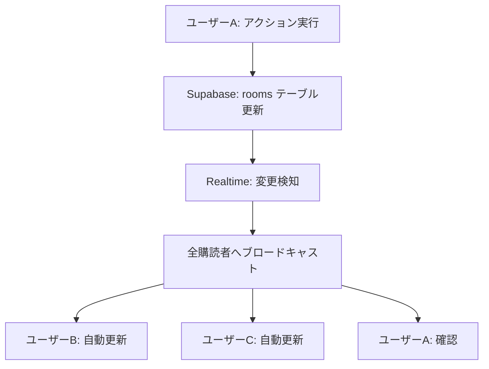

# Realtime サブスクリプション実装状況と今後の計画

## 📊 現状分析

### ✅ 既に実装済みの機能

#### 1. **基本的な Realtime サブスクリプション**

[`useRoomRealtime.ts`](../app/hooks/useRoomRealtime.ts)フックが実装済み

**実装内容:**

- ルーム ID に基づく初期データ取得
- Supabase Realtime チャンネルの作成と購読
- `UPDATE`イベントの監視（ルーム情報の更新）
- `DELETE`イベントの監視（ルームの削除）
- 自動クリーンアップ（アンマウント時）
- エラーハンドリング

**技術詳細:**

```typescript
const channel = supabase
  .channel(`room-${roomId}`)
  .on(
    "postgres_changes",
    {
      event: "UPDATE",
      schema: "public",
      table: "rooms",
      filter: `id=eq.${roomId}`,
    },
    (payload) => {
      setRoom(payload.new as Room);
    }
  )
  .subscribe();
```

#### 2. **ゲーム画面での Realtime 利用**

[`game/[id].tsx`](../app/app/game/[id].tsx)で`useRoomRealtime`を使用

**実装内容:**

- リアルタイムでルーム状態を取得
- プレイヤー一覧の自動更新
- ステータス変更の即座反映
- ゲーム開始/終了処理（本日実装完了）

#### 3. **ルーム管理 API**

[`roomApi.ts`](../app/lib/roomApi.ts)に以下の関数が実装済み

- `createRoom()` - ルーム作成
- `findRoomByCode()` - ルームコード検索
- `joinRoom()` - ルーム参加（プレイヤーを current_state に追加）
- `leaveRoom()` - ルーム退出
- `deleteRoom()` - ルーム削除
- `updateRoomStatus()` - ステータス更新（waiting/playing/finished）

### 🔄 Realtime の動作フロー



## 🎯 追加実装が必要な機能

### Phase 3: ゲーム機能の完成

#### 1. **アクション実行機能** 🔴 未実装

**優先度: 高**

現在、[`handleActionPress`](../app/app/game/[id].tsx:91)は確認ダイアログを表示するのみ。

**実装が必要な内容:**

- 計算式の評価（例: `score - 1000`）
- プレイヤーの状態更新
- Supabase への更新リクエスト
- 楽観的 UI 更新（オプション）

**実装例:**

```typescript
const handleActionPress = async (action: Action) => {
  if (!room || !user || !isUserInGame) return;

  try {
    // 現在の状態を取得
    const currentState = room.current_state[user.id];

    // 計算式を評価
    const newValues = evaluateAction(action.calc, currentState);

    // 状態を更新
    const updatedState = {
      ...room.current_state,
      [user.id]: {
        ...currentState,
        ...newValues,
      },
    };

    // Supabaseに保存
    await supabase
      .from("rooms")
      .update({ current_state: updatedState })
      .eq("id", room.id);
  } catch (error) {
    Alert.alert("エラー", "アクションの実行に失敗しました");
  }
};
```

#### 2. **計算式評価エンジン** 🔴 未実装

**優先度: 高**

アクションの`calc`フィールド（例: `"score - 1000"`）を評価する機能。

**実装が必要な内容:**

- 安全な式評価（eval()は使わない）
- 変数の置換
- 基本的な算術演算のサポート
- エラーハンドリング

**実装場所:**
新規ファイル: [`app/utils/calculateExpression.ts`](../app/utils/calculateExpression.ts)

**実装例:**

```typescript
export function evaluateAction(
  calc: string,
  currentState: PlayerState
): Partial<PlayerState> {
  // 例: "score - 1000" → { score: 24000 }
  // 例: "riichi + 1" → { riichi: 1 }

  // 計算式をパース
  const match = calc.match(/(\w+)\s*([\+\-\*\/])\s*(\d+)/);
  if (!match) throw new Error("Invalid calculation");

  const [, variable, operator, value] = match;
  const currentValue = currentState[variable] as number;
  const numValue = parseInt(value);

  let newValue: number;
  switch (operator) {
    case "+":
      newValue = currentValue + numValue;
      break;
    case "-":
      newValue = currentValue - numValue;
      break;
    case "*":
      newValue = currentValue * numValue;
      break;
    case "/":
      newValue = currentValue / numValue;
      break;
    default:
      throw new Error("Invalid operator");
  }

  return { [variable]: newValue };
}
```

#### 3. **ゲーム参加時の初期化改善** 🟡 部分実装

**優先度: 中**

現在、[`joinRoom`](../app/lib/roomApi.ts:142)でプレイヤーを追加しているが、以下の改善が必要:

- ゲーム開始後の参加制限
- 最大プレイヤー数の制限（オプション）
- 参加通知の表示

#### 4. **接続状態の監視** 🟡 未実装

**優先度: 中**

ネットワーク切断時の処理。

**実装が必要な内容:**

- 接続状態の監視
- 切断時の通知表示
- 再接続時の状態同期

**実装場所:**
[`useRoomRealtime.ts`](../app/hooks/useRoomRealtime.ts)に追加

**実装例:**

```typescript
.subscribe((status) => {
  console.log('Subscription status:', status);
  if (status === 'SUBSCRIBED') {
    setConnectionStatus('connected');
  } else if (status === 'CHANNEL_ERROR') {
    setConnectionStatus('error');
  }
});
```

### Phase 4: テンプレート機能

#### 5. **Builder/Settings 画面** 🔴 未実装

**優先度: 中**

ホストがゲーム中にテンプレートを編集できる機能。

**実装が必要な内容:**

- 変数の追加/削除/編集
- アクションの追加/削除/編集
- リアルタイムでの反映
- 編集権限の制御（ホストのみ）

**実装場所:**
新規ファイル: [`app/app/game/settings.tsx`](../app/app/game/settings.tsx)

#### 6. **プリセットテンプレート** 🟢 実装済み（部分）

**優先度: 低**

現在、麻雀テンプレートは[`create-room.tsx`](<../app/app/(tabs)/create-room.tsx>)にハードコード済み。

**改善案:**

- テンプレートを別ファイルに分離
- 複数のプリセットを用意
- テンプレート選択 UI

### Phase 5: UX 改善

#### 7. **楽観的 UI 更新** 🔴 未実装

**優先度: 低**

アクション実行時、Supabase からの応答を待たずに UI を更新。

**メリット:**

- レスポンスの向上
- ユーザー体験の改善

**デメリット:**

- 実装の複雑化
- エラー時のロールバック処理が必要

#### 8. **ルームコードのコピー機能** 🔴 未実装

**優先度: 低**

ルームコードをクリップボードにコピー。

**実装:**

```typescript
import * as Clipboard from "expo-clipboard";

const copyRoomCode = async () => {
  await Clipboard.setStringAsync(room.room_code);
  Alert.alert("コピーしました", "ルームコードをクリップボードにコピーしました");
};
```

#### 9. **QR コード表示** 🔴 未実装

**優先度: 低**

ルーム参加用の QR コード生成。

**依存関係:**

```bash
npm install react-native-qrcode-svg
```

## 📋 実装優先順位

### 🔥 最優先（Phase 3 完成に必須）

1. **アクション実行機能**
   - 計算式評価エンジン
   - 状態更新処理
   - Realtime 反映

### 🎯 高優先度（コア機能）

2. **接続状態の監視**

   - オフライン検知
   - 再接続処理

3. **Builder/Settings 画面**
   - テンプレート編集
   - リアルタイム反映

### 📌 中優先度（UX 改善）

4. **ゲーム参加制限**

   - 開始後の参加制限
   - 最大人数制限

5. **プリセットテンプレート**
   - テンプレート分離
   - 選択 UI

### 💡 低優先度（便利機能）

6. **楽観的 UI 更新**
7. **ルームコードコピー**
8. **QR コード表示**

## 🚀 次のステップ

### ステップ 1: 計算式評価エンジンの実装

**ファイル:** [`app/utils/calculateExpression.ts`](../app/utils/calculateExpression.ts)

```typescript
// 基本的な算術演算をサポート
// 例: "score - 1000" → 現在のscoreから1000を引く
// 例: "riichi + 1" → riichiに1を加える
```

### ステップ 2: アクション実行機能の実装

**ファイル:** [`app/app/game/[id].tsx`](../app/app/game/[id].tsx)

```typescript
// handleActionPress関数を完全実装
// 1. 計算式を評価
// 2. current_stateを更新
// 3. Supabaseに保存
// 4. Realtimeで全員に反映
```

### ステップ 3: 接続状態監視の追加

**ファイル:** [`app/hooks/useRoomRealtime.ts`](../app/hooks/useRoomRealtime.ts)

```typescript
// 接続状態を返す
// 切断時の通知
// 再接続処理
```

## 🔧 技術的な考慮事項

### Realtime のパフォーマンス

**現在の実装:**

- 1 ルームにつき 1 チャンネル
- 全プレイヤーが同じチャンネルを購読
- `current_state`全体を毎回送信

**最適化案（将来）:**

- 差分更新の実装
- プレイヤー数が多い場合のバッチ処理
- 不要な更新の抑制

### セキュリティ

**現在の実装:**

- RLS ポリシーで読み取り制御
- ゲストでも`current_state`を更新可能

**改善案（将来）:**

- アクション実行のレート制限
- 不正な計算式の検証
- ホスト権限の強化

### エラーハンドリング

**現在の実装:**

- 基本的な try-catch と Alert 表示

**改善案:**

- より詳細なエラーメッセージ
- リトライ機能
- オフライン時のキュー

## 📚 参考資料

- [Supabase Realtime Documentation](https://supabase.com/docs/guides/realtime)
- [Supabase Realtime Broadcast](https://supabase.com/docs/guides/realtime/broadcast)
- [React Native Performance](https://reactnative.dev/docs/performance)

## ✅ まとめ

### 現状

- ✅ 基本的な Realtime サブスクリプションは完全実装済み
- ✅ ルーム作成・参加・状態管理は動作中
- ✅ ゲーム開始/終了処理は実装完了（本日）
- 🔴 アクション実行機能が未実装（最優先）

### 次のアクション

1. 計算式評価エンジンを実装
2. アクション実行機能を完成
3. 接続状態監視を追加
4. Builder/Settings 画面を実装

これらを実装すれば、**Phase 3 が完全に完了**し、実際にゲームをプレイできる状態になります。
